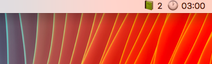

Book Streak
---
Simple CSV to [bitbar](https://github.com/matryer/bitbar) plugin for calculating time & day streak.

### Example CSV
```
Date, Minutes
27.01.2019, 120
28.01.2019, 60
```

### Example output


### Configuration
Add `.book-streak-config` fiel to your home directory. Example config file:

```
FILE=path/to/csv
```
